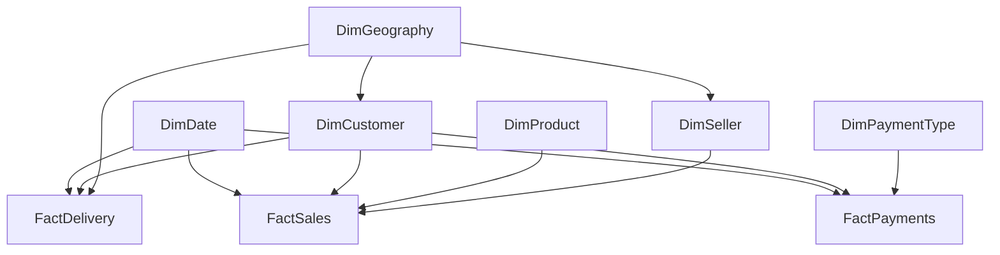
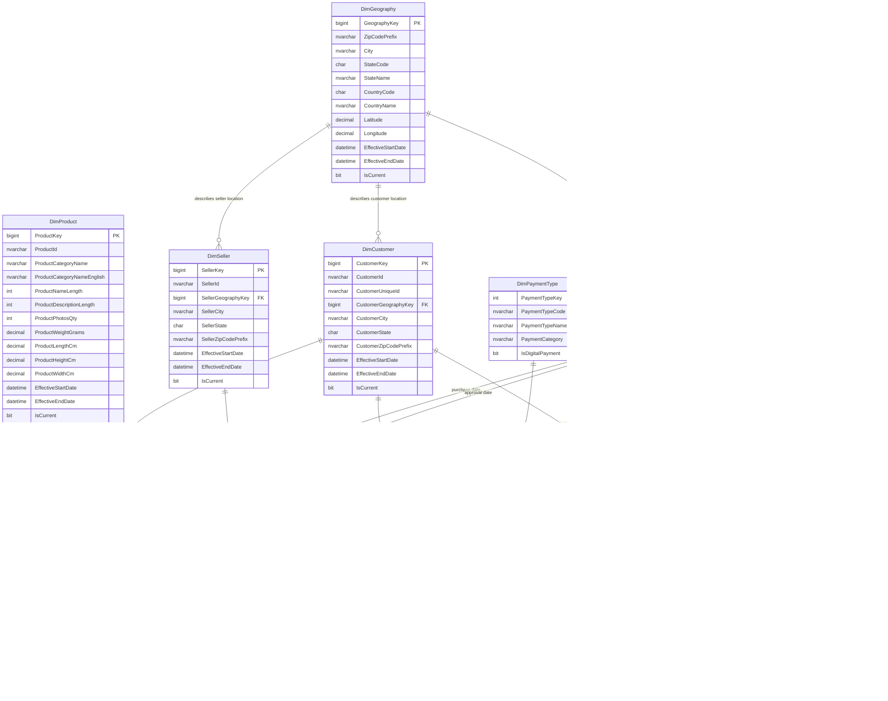

# Enterprise Data Warehouse Design

## Project

Olist E-Commerce Intelligence Platform

## Scope

This document defines the enterprise analytics warehouse that will be loaded into Azure Synapse Analytics after Gold-layer processing. It is not an OLTP design and does not define ingestion, Kafka, Spark, Bronze, or Silver implementation logic.

The warehouse is designed for:

- Executive and operational BI in Power BI
- Time-series sales, payment, and delivery analytics
- Customer, product, seller, and geography analysis
- dbt-managed dimensional transformations
- Machine-learning feature extraction from governed analytical tables

## Architecture Placement

```text
CSV Files
  |
  v
Apache Kafka
  |
  v
Azure Databricks / PySpark
  |
  v
Bronze Delta
  |
  v
Silver Delta
  |
  v
dbt Transformations
  |
  v
Gold Layer
  |
  v
Azure Synapse Enterprise Data Warehouse
  |
  +--> Power BI
  +--> FastAPI
  +--> Machine Learning
```

## Why Star Schema

A star schema was selected because it follows Kimball dimensional modeling best practices for analytics workloads. It separates measurable business events into fact tables and descriptive context into dimensions. This produces a model that is easy for BI users to understand, efficient for aggregate queries, and stable as new marts or semantic models are added.

Compared with a normalized OLTP model, this design:

- Reduces join complexity for Power BI and analyst queries
- Supports high-performance aggregations by date, product, customer, seller, geography, and payment type
- Preserves clear fact grains for reliable metrics
- Enables conformed dimensions across sales, payment, and delivery domains
- Supports slowly changing dimensions for historical reporting

## Synapse Optimization Strategy

The DDL scripts are optimized for Azure Synapse dedicated SQL pool patterns:

- Dimension tables use `DISTRIBUTION = REPLICATE` because they are small lookup tables joined frequently to large facts.
- Fact tables use `CLUSTERED COLUMNSTORE INDEX` for large analytic scans and compression.
- Fact tables use `DISTRIBUTION = HASH(CustomerKey)` to support common customer, geography, cohort, and order-analysis workloads.
- Primary keys are declared `NOT ENFORCED`, matching Synapse metadata behavior.
- Foreign keys are defined as logical relationships in this document and SQL comments because Azure Synapse dedicated SQL pool does not enforce relational foreign keys.
- Surrogate keys decouple warehouse history from operational business identifiers.

## Star Schema Diagram



## Mermaid ERD



## Fact Tables

### FactSales

**Business description:** Captures sold order items and related sales amounts. It supports revenue, freight, seller performance, category performance, customer purchasing behavior, and order-status analytics.

**Grain:** One row per order item from an Olist order.

**Primary key:** `SalesKey`

**Foreign keys:**

- `CustomerKey` to `DimCustomer`
- `ProductKey` to `DimProduct`
- `SellerKey` to `DimSeller`
- `OrderPurchaseDateKey` to `DimDate`
- `OrderApprovedDateKey` to `DimDate`

**Important measures:**

- `Quantity`
- `ItemPriceAmount`
- `FreightAmount`
- `GrossSalesAmount`
- `TotalItemAmount`

**Design rationale:** Order item grain allows product, seller, category, and customer analysis without double-counting item-level revenue. `OrderId` is retained as a degenerate dimension for traceability and drill-through.

### FactPayments

**Business description:** Captures payment events associated with customer orders. It supports payment method analysis, installment behavior, revenue collection analysis, and customer payment preferences.

**Grain:** One row per payment sequence for an order.

**Primary key:** `PaymentKey`

**Foreign keys:**

- `CustomerKey` to `DimCustomer`
- `PaymentTypeKey` to `DimPaymentType`
- `OrderPurchaseDateKey` to `DimDate`

**Important measures:**

- `PaymentInstallments`
- `PaymentValueAmount`

**Design rationale:** Payments are modeled separately from sales because orders can have payment-specific details and potentially multiple payment sequences. This avoids mixing payment behavior with item-level sales facts.

### FactDelivery

**Business description:** Captures order delivery lifecycle milestones and derived delivery performance metrics. It supports logistics analytics, late-delivery analysis, SLA monitoring, and machine-learning features for delivery risk prediction.

**Grain:** One row per order delivery lifecycle.

**Primary key:** `DeliveryKey`

**Foreign keys:**

- `CustomerKey` to `DimCustomer`
- `CustomerGeographyKey` to `DimGeography`
- `OrderPurchaseDateKey` to `DimDate`
- `OrderApprovedDateKey` to `DimDate`
- `CarrierDeliveredDateKey` to `DimDate`
- `CustomerDeliveredDateKey` to `DimDate`
- `EstimatedDeliveryDateKey` to `DimDate`

**Important measures:**

- `DaysToCarrier`
- `DaysToCustomer`
- `EstimatedDeliveryDays`
- `DeliveryDelayDays`
- `IsDelivered`
- `IsLateDelivery`

**Design rationale:** Delivery is separated from sales because logistics performance has a different analytical grain and date lifecycle. Multiple date keys make the model time-series ready for purchase, approval, carrier, customer, and estimated delivery analysis.

## Dimension Tables

### DimCustomer

**Business description:** Describes Olist customers and supports customer-level segmentation, repeat purchase analysis, regional behavior, and cohort analysis.

**Primary key:** `CustomerKey`

**Business keys:** `CustomerId`, `CustomerUniqueId`

**Foreign keys:** `CustomerGeographyKey` to `DimGeography`

**SCD strategy:** Type 2. Customer location attributes can change over time or be corrected. Type 2 preserves historical reporting by keeping `EffectiveStartDate`, `EffectiveEndDate`, and `IsCurrent`.

### DimProduct

**Business description:** Describes products and product category attributes for sales, category, basket, and profitability analytics.

**Primary key:** `ProductKey`

**Business key:** `ProductId`

**SCD strategy:** Type 2. Product category translations, dimensions, weight, and descriptive attributes can be corrected or enriched over time. Historical product context should be preserved.

### DimSeller

**Business description:** Describes marketplace sellers and their geography for seller performance, regional seller coverage, and logistics analysis.

**Primary key:** `SellerKey`

**Business key:** `SellerId`

**Foreign keys:** `SellerGeographyKey` to `DimGeography`

**SCD strategy:** Type 2. Seller geography and descriptive attributes can change or be corrected, and historical performance should remain tied to the version active at the time of the transaction.

### DimDate

**Business description:** Provides a conformed calendar dimension for time-series analysis across sales, payments, and delivery lifecycle events.

**Primary key:** `DateKey`

**Business key:** `FullDate`

**SCD strategy:** Type 0. Calendar attributes are static and should not change.

### DimGeography

**Business description:** Describes geographic locations for customers, sellers, and delivery destinations. It enables state, city, and regional analytics.

**Primary key:** `GeographyKey`

**Business keys:** `ZipCodePrefix`, `City`, `StateCode`, `CountryCode`

**SCD strategy:** Type 2. Geography reference data can be corrected, standardized, or enriched with coordinates. Type 2 keeps historical analytics reproducible.

### DimPaymentType

**Business description:** Describes payment methods such as credit card, boleto, voucher, and debit card. It supports payment mix, installment, and digital payment analytics.

**Primary key:** `PaymentTypeKey`

**Business key:** `PaymentTypeCode`

**SCD strategy:** Type 1. Payment type labels and categories are reference attributes where corrections should overwrite previous values.

## Slowly Changing Dimensions Strategy

The warehouse uses Type 2 dimensions where historical context matters:

- `DimCustomer`
- `DimProduct`
- `DimSeller`
- `DimGeography`

Type 2 dimensions include:

- Surrogate key
- Business key
- Effective start timestamp
- Effective end timestamp
- Current-row flag
- Created and updated timestamps

Facts should join to the surrogate key version that was current at the business event date. This preserves historical truth even if customer, product, seller, or geography attributes change later.

Type 1 or Type 0 handling is used where history is not analytically meaningful:

- `DimPaymentType`: Type 1 reference corrections
- `DimDate`: Type 0 static calendar

## Surrogate Key Strategy

All facts use surrogate keys for dimensional relationships. Business identifiers such as `OrderId`, `CustomerId`, `ProductId`, and `SellerId` are retained only where useful for lineage, drill-through, and reconciliation.

Surrogate keys should be generated in dbt or the Gold transformation layer before loading Synapse. This keeps Synapse focused on analytic serving and avoids coupling BI models to source-system keys.

## dbt Integration

dbt should own warehouse transformation logic and dimensional loading patterns:

- Stage Silver/Gold inputs as normalized source models
- Build dimension models with surrogate keys and SCD Type 2 logic
- Build fact models at explicitly tested grains
- Add dbt tests for uniqueness, not-null keys, accepted values, and referential integrity
- Generate documentation and lineage for dimensions and facts

Recommended dbt model grouping:

- `stg_*` for source-aligned cleanup
- `int_*` for reusable business transformations
- `dim_*` for warehouse dimensions
- `fact_*` for warehouse facts

## Power BI Integration

The schema is Power BI friendly because:

- Fact tables have clear numeric measures
- Dimensions are conformed and reusable
- Relationships are simple one-to-many joins from dimensions to facts
- Date analysis is centralized through `DimDate`
- Business keys are available for drill-through but not used as relationship keys

Power BI semantic models should:

- Hide surrogate keys from report consumers
- Mark `DimDate` as the date table
- Use facts for measures and dimensions for slicers
- Avoid many-to-many relationships
- Define certified measures for revenue, freight, payments, late deliveries, and delivery duration

## Machine-Learning Readiness

The warehouse supports ML feature engineering through stable, governed tables:

- Customer purchase frequency and recency from `FactSales`
- Payment behavior from `FactPayments`
- Delivery delay and SLA features from `FactDelivery`
- Product category and physical dimensions from `DimProduct`
- Regional features from `DimGeography`

The model is suitable for forecasting, segmentation, delivery-delay prediction, churn-style retention analysis, and seller performance scoring.

## DDL Scripts

Execute scripts in this order:

1. `warehouse/sql/00_create_schema.sql`
2. `warehouse/sql/01_create_dimensions.sql`
3. `warehouse/sql/02_create_facts.sql`

These scripts are designed for Azure Synapse Analytics dedicated SQL pool.
